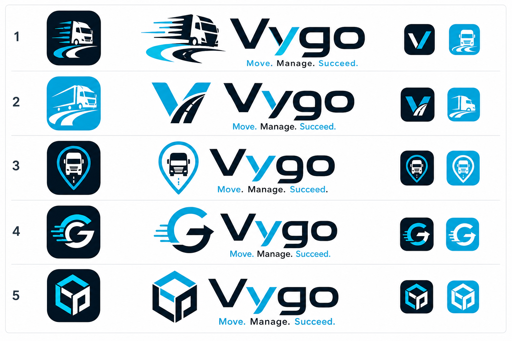
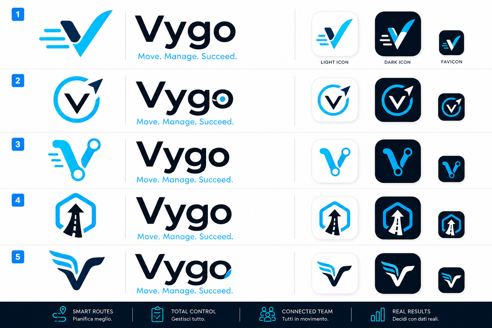
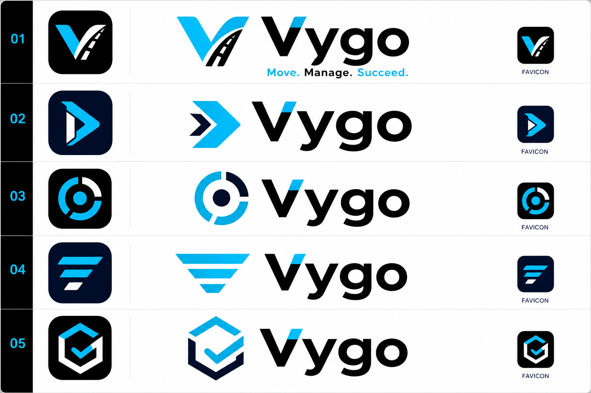
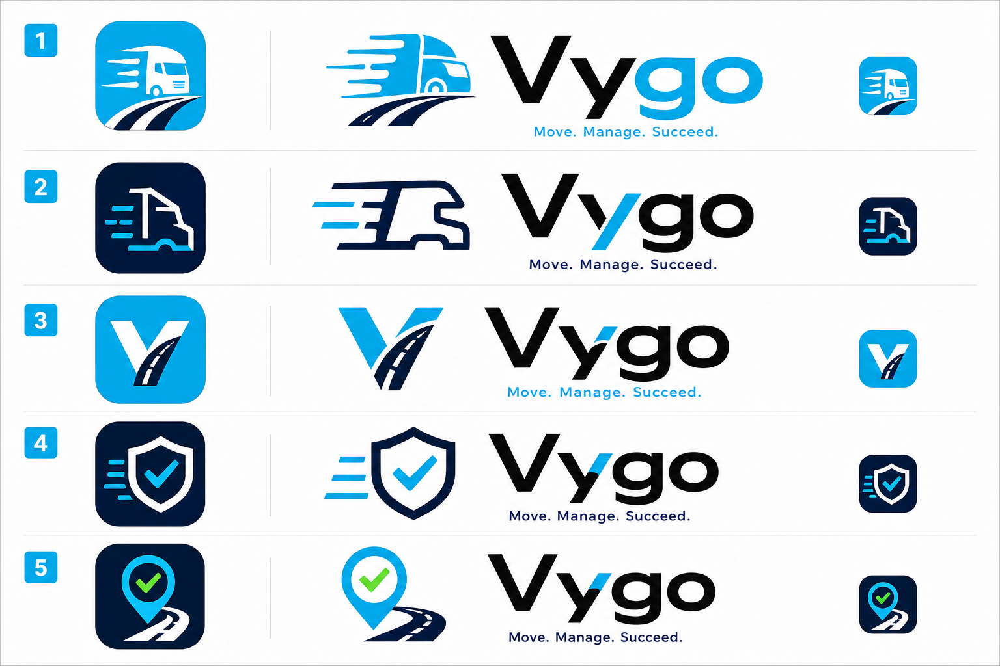
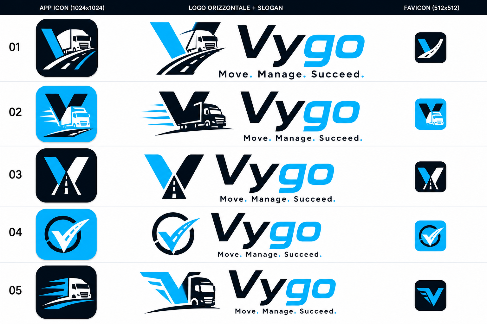
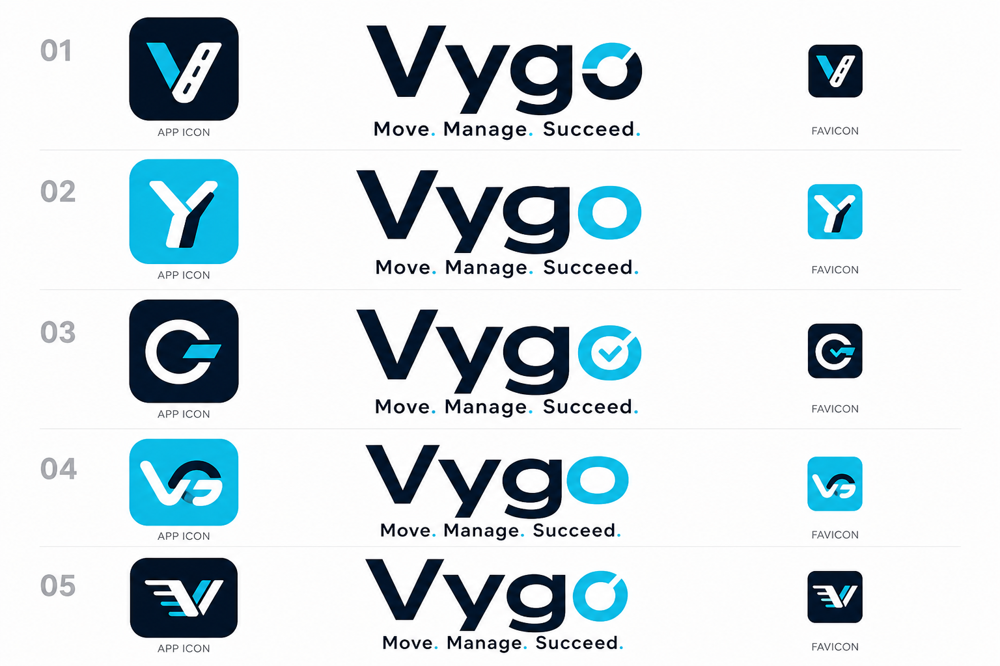
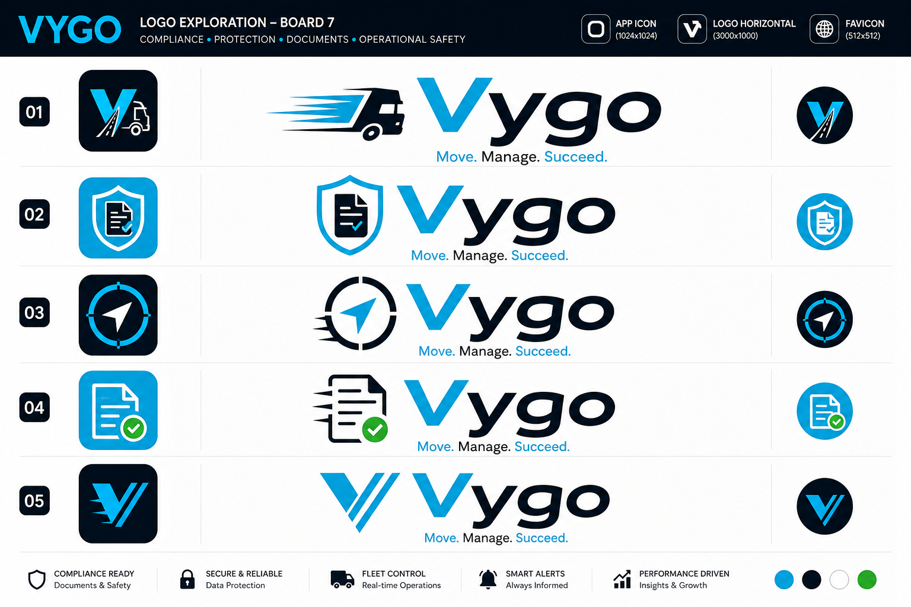
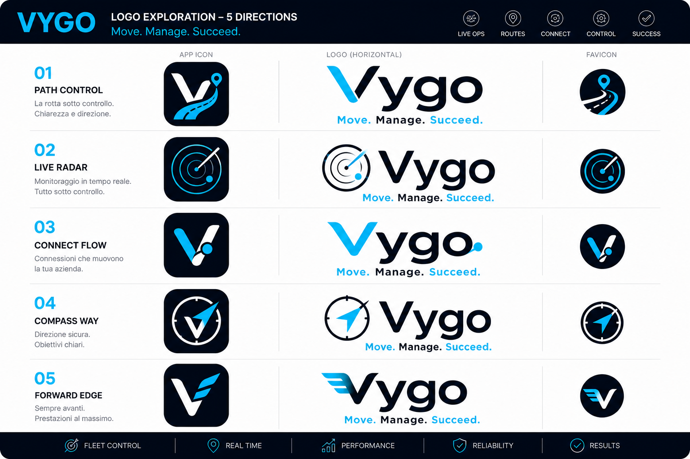
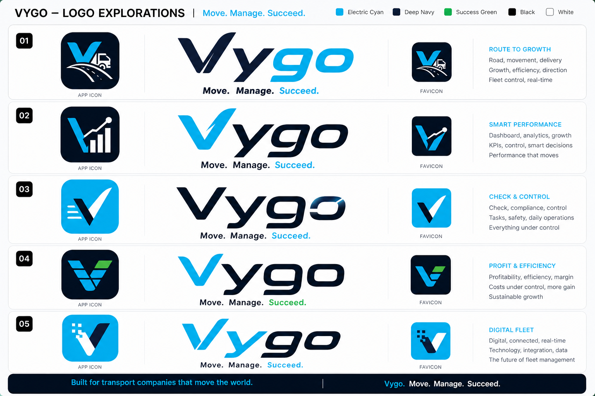
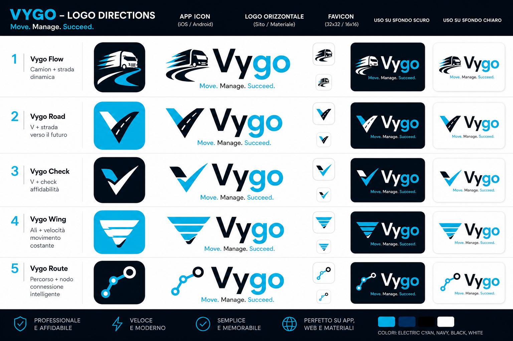

# Selezione loghi Vygo

Raccolta di 50 loghi concept per Vygo.

Queste tavole servono per scegliere la direzione visiva. Il logo finale andra poi ricostruito pulito in vettoriale, con icona app, favicon, logo orizzontale, versione chiara/scura e file pronti per sito, iOS e Android.

Slogan fisso: Move. Manage. Succeed.

## Direzione scelta

La direzione scelta arriva dalla **Tavola 1 - Camion e percorso**, combinando questi elementi:

- **Icona app principale:** riga 1 a sinistra, camion su sfondo nero.
- **Logo orizzontale / scritta Vygo:** riga 1 centrale, camion + strada + scritta Vygo.
- **Icona secondaria / favicon:** riga 2, quadratino nero con V + strada.

File finali puliti dalla scelta: [assets/brand-render-clean](assets/brand-render-clean).

Motivo: l icona camion su fondo nero richiama subito il mondo trasporto e il logo orizzontale centrale della riga 1 e quello piu riconoscibile per sito e materiali. L icona V-strada della riga 2 resta perfetta come simbolo piccolo o favicon. I file finali sono puliti dai bordi sporchi del rendering originale.

## Tavola 1 - Camion e percorso

Direzione: piu vicina al vecchio camioncino, ma resa piu moderna e seria.

## Tavola 2 - App minimal

Direzione: piu semplice, riconoscibile da telefono, adatta a icona app.

## Tavola 3 - Premium B2B

Direzione: piu aziendale, nera/celeste, pensata per vendere un prodotto premium.

## Tavola 4 - Trasporto friendly

Direzione: piu calda e riconoscibile per trasportatori, con simboli strada/camion/check piu immediati.

## Tavola 5 - Truck route iconico

Direzione: camion, strada e V come simbolo unico, piu iconica e meno generica.

## Tavola 6 - Monogramma app

Direzione: lettere V/Y/G/O trasformate in segni semplici da icona app.

## Tavola 7 - Sicurezza e conformita

Direzione: documenti, check, protezione e controllo operativo.

## Tavola 8 - Rotte e navigazione

Direzione: percorso, radar, rotta e operativita live della flotta.

## Tavola 9 - Costi e controllo

Direzione: report, costi, efficienza e controllo economico.

## Tavola 10 - Candidati finali app

Direzione: icone piu forti per iOS, Android, sito e favicon.
